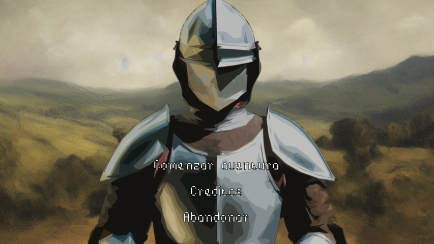
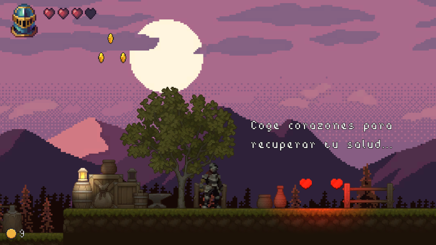
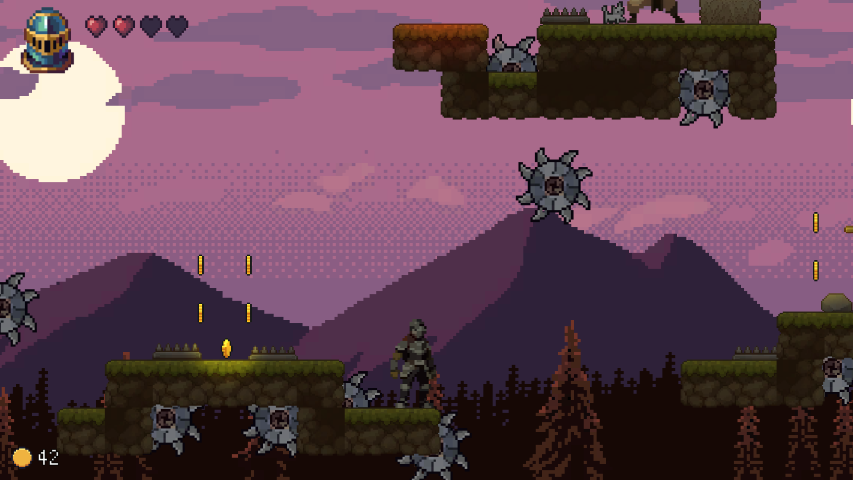
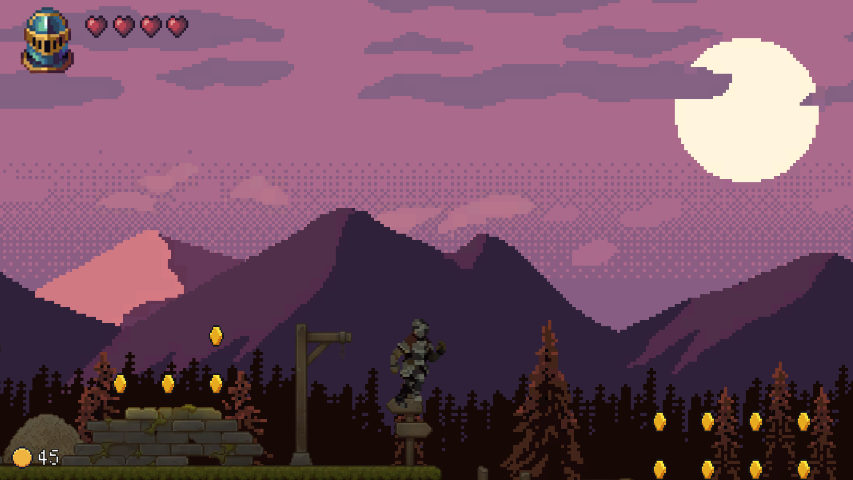
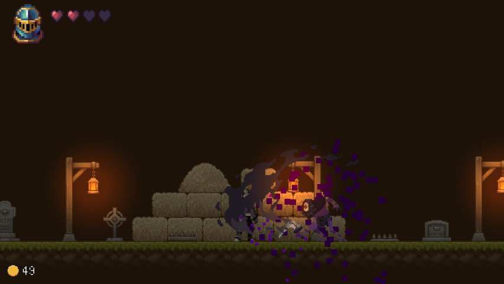
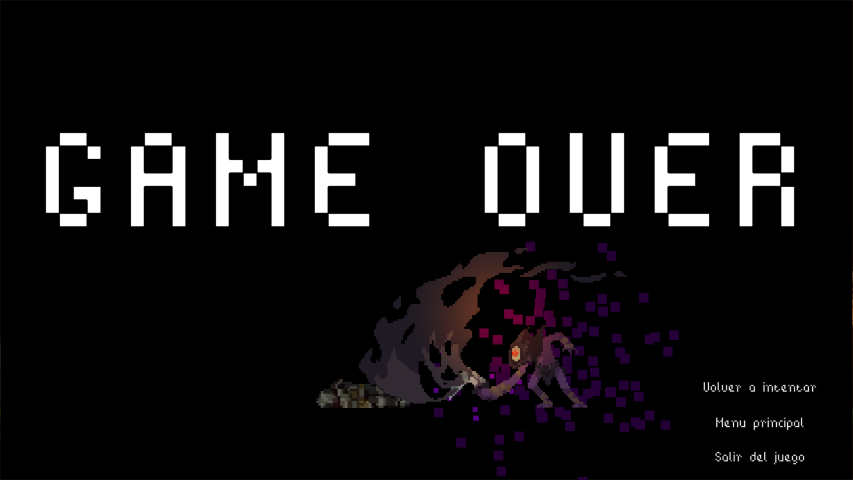

# ManriQuest
ManriQuest is a platform video game set in medieval fantasy with 2D graphics. In the game, you will advance by collecting coins and dodging traps until you face a dangerous final enemy.

It was built using the Unity game engine and royalty-free internet resources.

> [!NOTE]  
> This app was made when I was a student and had a tight deadline, so don't expect quality code. 

## Images

